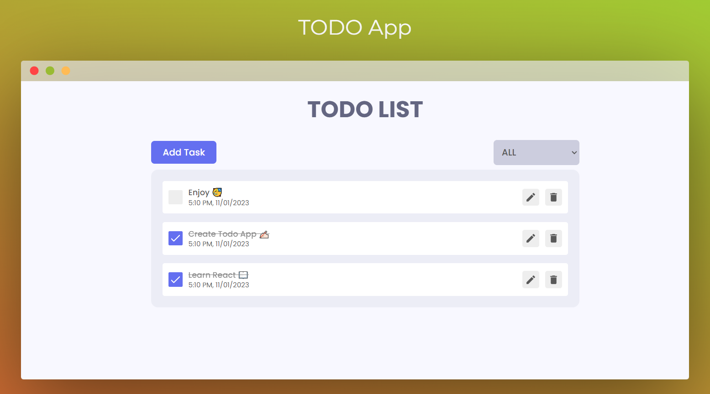

# React Todo App

A complete Todo application with all features, created with ❤️ by Aditya Armal.

## Project Description

In this project, we have built a comprehensive Todo Application that includes all essential features. We have implemented Create, Read, Update, and Delete (CRUD) operations. The application is developed using React.js, and for state management, we have utilized Redux. Additionally, we've incorporated simple animations using Framer Motion. This project is beginner-friendly and designed to help you learn the fundamentals of building a React-based Todo application. We hope you enjoy using it!

## What I Learnt/Used

- **React**: The core library for building the user interface.
- **React Redux**: Utilized for state management.
- **Framer Motion**: Used to create simple animations for a more engaging user experience.
- **React icons**: For adding icons to the application.
- **React Hot Toast**: A library for displaying toasts and notifications in React applications.
- **uuid**: A library for generating universally unique identifiers.

## Tools Used

The following tools were used in the development of this project:

- **Favicon**: The favicon for this project was obtained from [Flaticon.com](https://www.flaticon.com/).
- **Code Editor**: [Visual Studio Code (VS Code)](https://code.visualstudio.com/) was used as the code editor.

## Visual Studio Code Extensions

To enhance your development experience, the following Visual Studio Code extensions were used in this project:

- **ES7+ React/Redux/React-Native snippets**: Provides helpful code snippets for React, Redux, and React Native development.
- **ESLint**: A linter that helps maintain code quality and style.
- **GitHub Theme (Default)**: The GitHub-inspired theme for a clean coding interface.
- **Prettier - Code formatter**: Ensures consistent code formatting and style.

## Requirements

Before getting started with this project, you should have:

- Basic knowledge of React.js.
- Basic knowledge of HTML and CSS.

## Usage

1. Clone this repository to your local machine:

```bash
  git clone https://github.com/aditya-armal/react-todo-app.git
```
Navigate to the project directory:

```bash
cd react-todo-app
```
Install the project dependencies:

```bash
npm install
```
Start the development server:

```bash
npm start
```
Open your web browser and visit http://localhost:3000 to access the Todo App.

Live Demo
You can explore the live demo of this Todo App by visiting below link.

